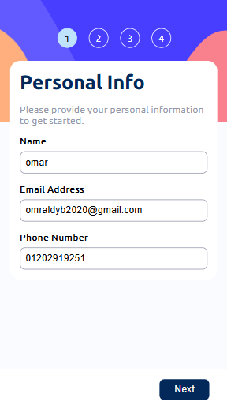
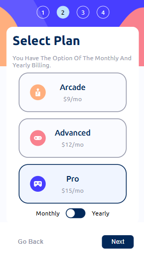
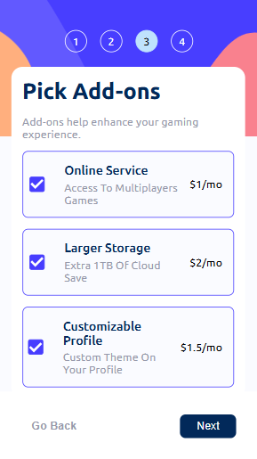
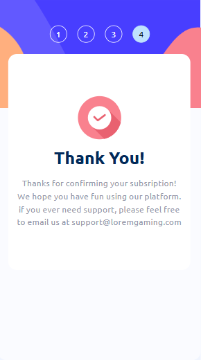
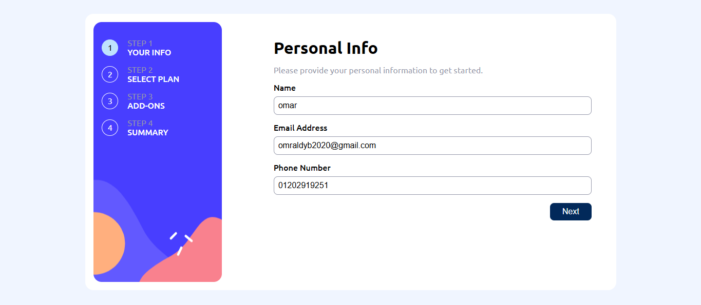
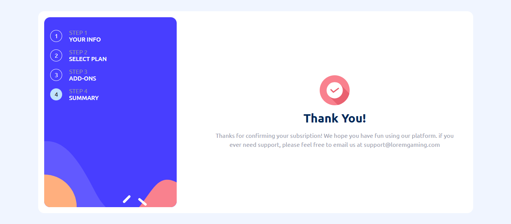
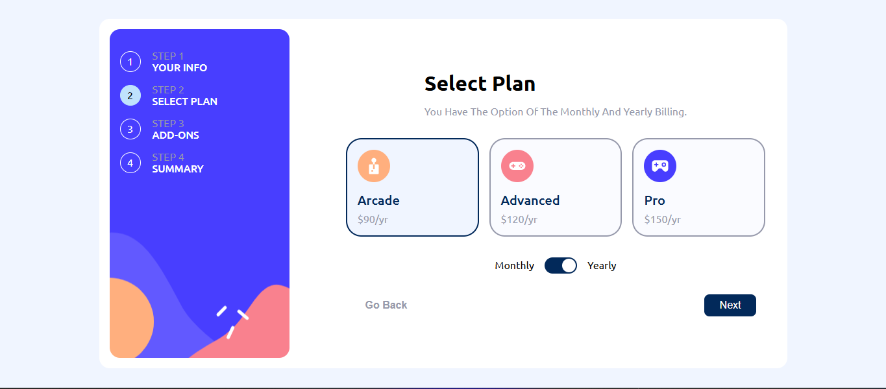
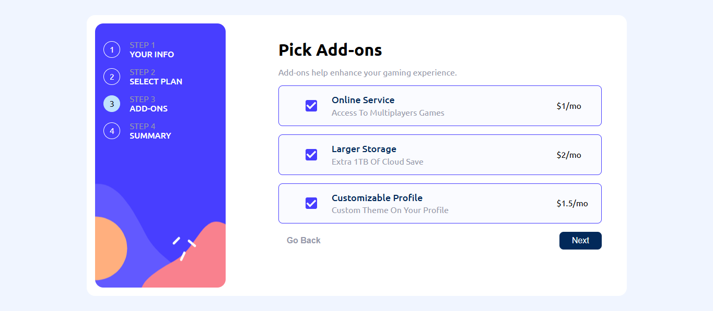
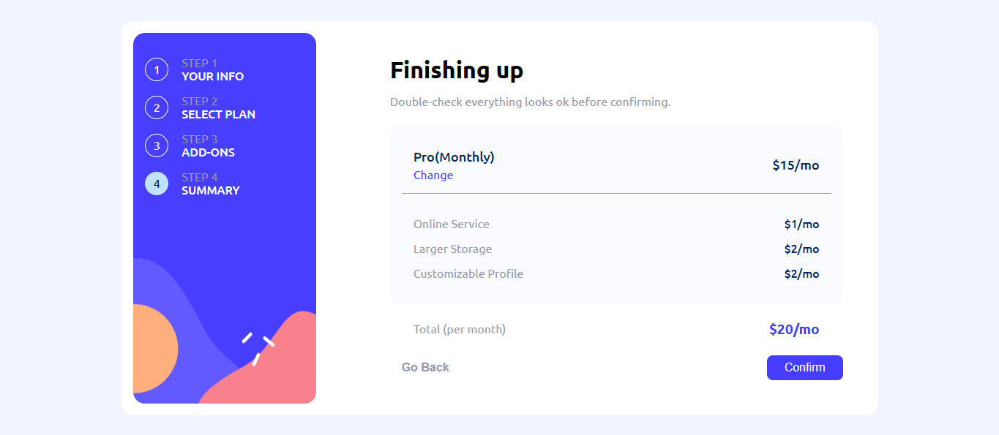

# Frontend Mentor - Multi-step form solution

This is a solution to the [Multi-step form challenge on Frontend Mentor](https://www.frontendmentor.io/challenges/multistep-form-YVAnSdqQBJ). Frontend Mentor challenges help you improve your coding skills by building realistic projects. 

## Table of contents

- [Overview](#overview)
  - [The challenge](#the-challenge)
  - [Screenshot](#screenshot)
  - [Links](#links)
- [My process](#my-process)
  - [Built with](#built-with)
- [Author](#author)

## Overview

### The challenge

Users should be able to:

- Complete each step of the sequence
- Go back to a previous step to update their selections
- See a summary of their selections on the final step and confirm their order
- View the optimal layout for the interface depending on their device's screen size
- See hover and focus states for all interactive elements on the page
- Receive form validation messages if:
  - A field has been missed
  - The email address is not formatted correctly
  - A step is submitted, but no selection has been made

### Screenshot












### Links

- Solution URL: [Add solution URL here](https://your-solution-url.com)
- Live Site URL: [Add live site URL here](https://your-live-site-url.com)

## My process

### Built with

- Semantic HTML5 markup
- CSS custom properties
- Flexbox
- CSS Grid
- Mobile-first workflow
- [**TypeScript**](https://www.typescriptlang.org/) – JavaScript superset  
- [**Sass**](https://sass-lang.com/) – CSS preprocessor  
- [**Pug (PugJS)**](https://pugjs.org/) – HTML template engine  

```pug
    each step, index in steps
        li(class=index === 0 ? 'active' : '', id=`step-${index + 1}`, data-step=index + 1)
          p Step #{index + 1}
          div #{step}
    form#form.step-1
```
```scss

   .container {
      background-color: $neutral-white;
      height: 90vh;
      min-width: 60vw;
      max-width: 85vw;
      display: flex;
      border-radius: 1rem;
      padding: 1rem;

      #sidebar,
      form {
         display: flex;
         border-radius: 1rem;
      }

      #sidebar {
         background-repeat: no-repeat;
         background-size: cover;
         background-position: center;

         li {
            position: relative;
            cursor: pointer;
            min-width: 30px;
            min-height: 30px;

            &::before {
               content: attr(data-step);
               position: absolute;
               left: 0;
               top: 50%;
               transform: translateY(-50%);
               width: 30px;
               height: 30px;
               display: flex;
               justify-content: center;
               align-items: center;
               border-radius: 50%;
               border: 1px solid $neutral-white;
               color: $neutral-white;
            }
            
            &.active::before {
               background-color: $primary-blue-200;
               border-color: $primary-blue-200;
               color: black;
            }

            >* {
               display: none;
            }
         }
      }

      form {
         min-width: 50vw;

         .form-header {
            display: flex;
            flex-direction: column;
            gap: 1rem;
            text-align: start;
      
            h1 {
               font-size: 2rem;
            }
      
            p {
               color: $neutral-grey-500;
               font-size: $font-size-paragraph;
            }
         }

         .form-footer {
            display: flex;
            justify-content: space-between;
            align-items: center;
            width: 100%;

            .form-back {
               font-size: $font-size-paragraph;
               padding: 0.5rem 1rem;
               background-color: transparent;
               font-weight: bold;
               cursor: pointer;
               border: none;
               color: $neutral-grey-500;
         
               &:hover {
                  color: $primary-blue-950;
               }
            }

            .form-next,
            .form-submit {
               padding: .5rem 1.5rem;
               background-color: $primary-blue-950;
               color: $neutral-white;
               border-radius: 0.5rem;
               font-size: $font-size-paragraph;
               font-weight: 500;
               cursor: pointer;
               border: none;
               transition: background-color 0.3s ease;

               &:hover {
                  background-color: lighten($primary-blue-950, 10%);
               }
            }

            .form-submit {
               background-color: $primary-purple-600;

               &:hover {
                  background-color: $primary-blue-300;
               }
            }
         }

         &.step-1 {
            gap: 1rem;

            .form-group {
               display: flex;
               flex-direction: column;
               gap: 0.5rem;
               width: 100%;
               position: relative;
         
               label {
                  font-weight: 500;
               }
         
               input {
                  padding: 0.5rem;
                  border-radius: 0.5rem;
                  border: 1px solid $neutral-grey-500;
                  width: 100%;
                  font-size: $font-size-paragraph;
         
                  &:hover,
                  &:focus {
                     border-color: $primary-blue-950;
                     outline: none;
                     color: black;
                  }
               }
         
         
               &.invalid-message::after {
                  content: 'Invalid Input';
               }
         
               &.error-message::after {
                  content: 'This Field Is Required';
               }
         
         
               &.error-message,
               &.invalid-message {
                  input {
                     color: $primary-red-500;
                     border-color: $primary-red-500;
                     font-size: 0.875rem;
                  }
         
                  &::after {
                     position: absolute;
                     bottom: -15px;
                     height: 10px;
                     left: 10px;
                     color: $primary-red-500;
                  }
               }
         
            }

            .form-footer {
               justify-content: end;
            }
         }

         &.step-2 {
            justify-content: center;
            align-items: center;
            .options-container {
               display: flex;
               gap: 1rem;
               justify-content: center;
               align-items: center;
               min-width: 90%;

            .option {
               display: flex;
               flex: 1;
               flex-direction: column;
               justify-content: center;
               padding: 1rem;
               border-radius: 0.5rem;
               background-color: $neutral-blue-50;
               min-width: 15vw;
               min-height: 15vh;
               cursor: pointer;
               transition: background-color 0.3s ease;
               border-radius: 1.5rem;
               border: 2px solid $neutral-grey-500;
         
               &.selected {
                  background-color: $neutral-blue-100;
                  color: black;
                  border: 2px solid $primary-blue-950;
               }
         
               .icon-container {
                  width: 100%;
                  display: flex;
                  justify-content: start;
                  margin-bottom: 1rem;
         
                  img {
                     width: 50%;
                     max-width: 50px;
                     min-width: 25px;
                     height: auto;
                  }
               }
         
               &.active {
                  background-color: $primary-blue-200;
                  color: black;
                  border: 2px solid $primary-blue-950;
               }
         
               h4 {
                  font-size: 1.25rem;
                  font-weight: 500;
                  color: $primary-blue-950;
               }
         
               span {
                  margin-top: .5rem;
                  font-size: $font-size-paragraph;
                  color: $neutral-grey-500;
               }
            }
            }

            .billing-option {
               display: flex;
               align-items: center;
               justify-content: center;
               text-align: center;
               gap: 1rem;
               width: 80%;
               text-transform: capitalize;

               &.monthly {
                  .billing-toggle::before {
                     transform: translateX(0px);
                  }
               }

               .billing-toggle {
                  display: flex;
                  align-items: center;
                  justify-content: center;
                  width: 50px;
                  height: 25px;
                  background-color: $primary-blue-950;
                  border-radius: 50px;
                  cursor: pointer;
                  position: relative;

                  &::before {
                     content: '';
                     position: absolute;
                     top: 2px;
                     left: 2px;
                     width: 21px;
                     height: 21px;
                     background-color: $neutral-white;
                     border-radius: 50%;
                     transition: transform 0.3s ease;
                     transform: translateX(25px);
                  }
               }
            }
         }
         
         &.step-3 {
            gap: 1rem;
            .options-container {
               display: flex;
               flex-direction: column;
               gap: 1rem;
               width: 100%;

               .option {
                  display: flex;
                  justify-content: space-between;
                  align-items: center;
                  gap: 1rem;
                  padding: 1rem;
                  border-radius: 0.5rem;
                  background-color: $neutral-blue-50;
                  user-select: none;
                  cursor: pointer;
                  border: 1px solid $neutral-grey-500;

                  * {
                     pointer-events: none;
                  }

                  input {
                     flex: 1;
                     height: 100%;
                     appearance: none;
                  }

                  &:hover {
                     border: 1px solid $primary-purple-600;
                  }

                  &.checked {
                     border: 1px solid $primary-purple-600;

                     .option-label::before {
                        background-image: url('../assets/images/icon-checkmark.svg');
                        background-repeat: no-repeat;
                        background-size: contain;
                        background-position: center;
                        background-color: $primary-purple-600;
                        border-color: $primary-purple-600;
                     }
                  }

                  .option-label {
                     flex: 6;
                     display: flex;
                     flex-direction: column;
                     gap: 0.3rem;
                     position: relative;


                     &::before {
                        content: '';
                        transition: .3s;
                        position: absolute;
                        left: -50px;
                        top: 50%;
                        transform: translateY(-50%);
                        width: 20px;
                        height: 20px;
                        border-radius: .2rem;
                        background-color: $neutral-white;
                        border: 1px solid $neutral-grey-500;
                     }

                     h4 {
                        font-size: large;
                        font-weight: 500;
                        color: $primary-blue-950;
                     }

                     p {
                        color: $neutral-grey-500;
                     }
                  }

                  .option-price {
                     flex: 1;
                  }


               }
            }
         }

         &.step-4 {
            gap: 1.5rem;

            .summary,
            .summary-total {
               display: flex;
               gap: 1rem;
               width: 100%;
            }

            .summary {
               flex-direction: column;
               background-color: $neutral-blue-50;
               padding: 1rem;
               border-radius: .8rem;

               .summary-plan {
                  display: flex;
                  justify-content: space-between;
                  align-items: center;
                  gap: 0.5rem;
                  padding: 1rem;
                  border-bottom: 1px solid $neutral-grey-500;

                  .plan {
                     display: flex;
                     flex-direction: column;
                     gap: 0.3rem;

                     .name {
                        font-size: large;
                        font-weight: 500;
                        color: $primary-blue-950;
                     }

                     .change {
                        cursor: pointer;
                        color: $primary-purple-600;

                        &:hover {
                           text-decoration: underline;
                        }
                     }
                  }

                  .summary-price {
                     font-size: large;
                     font-weight: 500;
                     color: $primary-blue-950;
                  }
               }

               .summary-addOnes {
                  display: flex;
                  flex-direction: column;
                  gap: 1rem;
                  padding: 1rem;

                  .addOnes {
                     display: flex;
                     justify-content: space-between;
                     align-items: center;

                     .addOnes-name {
                        color: $neutral-grey-500;
                        font-size: $font-size-paragraph;
                     }

                     .addOnes-price {
                        color: $primary-blue-950;
                        font-weight: 500;
                     }
                  }
               }
            }

            .summary-total {
               align-items: center;
               padding-inline: 2rem;
               justify-content: space-between;

               .total {
                  color: $neutral-grey-500;
               }

               .total-price {
                  font-size: 1.2rem;
                  font-weight: 700;
                  color: $primary-purple-600;
               }
            }
         }

         &.step-5 {
            justify-content: center;

            .thank-you {
               display: flex;
               flex-direction: column;
               align-items: center;
               justify-content: center;
               gap: 1rem;
               text-align: center;

               h1 {
                  font-size: 2rem;
                  color: $primary-blue-950;
               }

               p {
                  color: $neutral-grey-500;
                  font-size: $font-size-paragraph;
                  line-height: 1.5rem;
               }
            }

            .form-footer {
               display: none; // Hide footer in the final step
            }
         }
      }
   }

   @media (max-width: 830px) {
      height: 110vh;

      .container {
         flex-direction: column;
         justify-content: space-between;
         align-items: center;
         gap: 5vh;
         position: relative;
         padding: 0;
         min-width: 100vw;
         min-height: 100vh;
         background-color: $neutral-blue-50;
         position: absolute !important;
         top: 0;
         
         
         #sidebar {
            background-image: url(../assets/images/bg-sidebar-mobile.svg);
            border-radius: 0;
            width: 100%;
            justify-content: space-evenly;
            padding-inline: 20vw;
            min-height: 30vh;
            align-items: start;
            padding-block: 3rem;
         }

         form {
            flex-direction: column;
            padding: 1rem;
            background-color: #fff;
            position: absolute;
            top: 15vh;
            max-width: 90vw;

            &.step-2 {
               .options-container {
                  flex-direction: column;
                  align-items: center;
                  gap: 1rem;
                  margin-block: .7rem;

                  .option {
                     width: 100%;
                     max-width: 300px;
                     // flex-direction: row;
                     padding: 1rem;
                     align-items: center;
                     justify-content: center;
                     text-align: center;
                     position: relative;

                     .icon-container {
                        flex: 1;
                        margin: 0;
                        width: fit-content;
                        max-width: 60px;
                        position: absolute;
                        left: 10%;
                        top: 50%;
                        transform: translateY(-50%);


                        img {
                           width: 100%;
                        }
                     }
                  }
               }
            }

            &.step-5 {
               height: 60vh;
            }

            .form-footer {
               position: fixed;
               width: 100vw;
               bottom: 0;
               left: 0;
               height: 15vh;
               background-color: $neutral-white;
               padding-inline: 2rem;
            }
         }
      }
   }
```
```ts
  function handleFormData(form: HTMLFormElement, data: any, step: string) {
    data.then((data: any) => {
        let stepData = data[step];
        form.innerHTML = ''; // Clear existing fields
        addHeader(stepData.title, stepData.description, form);
        handleSteps(step, stepData);
        addFooter(form, step);
    });
  }
```

## Author

- Website - [omar](https://omar-p-code.github.io/my_portfolio/public/index.html)
- Frontend Mentor - [@omar-p-code](https://www.frontendmentor.io/profile/omar-p-code)
